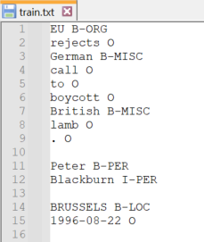
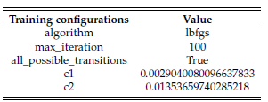
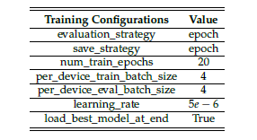

# The Effect of Data Quality on Named Entity Recognition

- The exponential growth of data in the digital age needs the identification and extraction of significant information, necessitating the use of machine learning models to efficiently handle unstructured data.

- Because of their popularity and demand, named entity recognition (NER) systems are recommended for these information extraction tasks, which require filtering specified entities from vast amounts of textual input.

- The robustness of three popular NER models was tested against datasets with varied amounts and types of noise revealing a decrease in model performance as dataset noise increased, with varying effects depending on the noise type.

- The work emphasizes the importance of data quality by demonstrating how different types and levels of noise affect the predictive capacity of NER models, thereby directly tying model performance to data quality.

## Datasets and their Source

1. CoNLL 2003 English dataset: https://huggingface.co/datasets/conll2003
2. WNUT 2016 dataset: https://github.com/aritter/twitter_nlp/tree/master/data/annotated/wnut16/data
3. OntoNotes v5 dataset: https://huggingface.co/datasets/conll2012_ontonotesv5

## Dataset Preparation

The train, dev and test set of each dataset should be converted into text files containing one token and their respective label in that line. For this a sentence should be divided into tokens of words and sentences should be seperated by an empty line. 

The text file should look like this:

## Introducing Errors in train and test sets

For this study, various noise types has been introduced in the train and test set of a dataset. 

For example, if you want to introduce spelling error in the train set of CoNLL 2003 English dataset, update the location of train set in Error2_spelling.py file in 'Add Error' folder and run the script. Five new text file will be generated containing spelling errors at different error rates used in this study. 

Follow the same steps for all other types of errors.

## Models configurations 

- Conditional Random Field (CRF): 

- Flair library (biLSTM + flair embeddings) configuration based on different datasets: https://github.com/flairNLP/flair/blob/master/resources/docs/EXPERIMENTS.md 
- BERT: 

   

